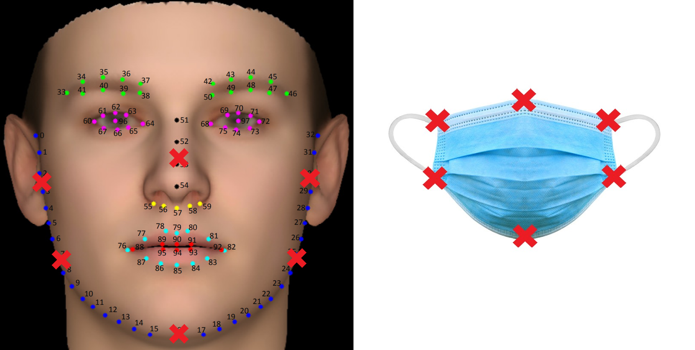
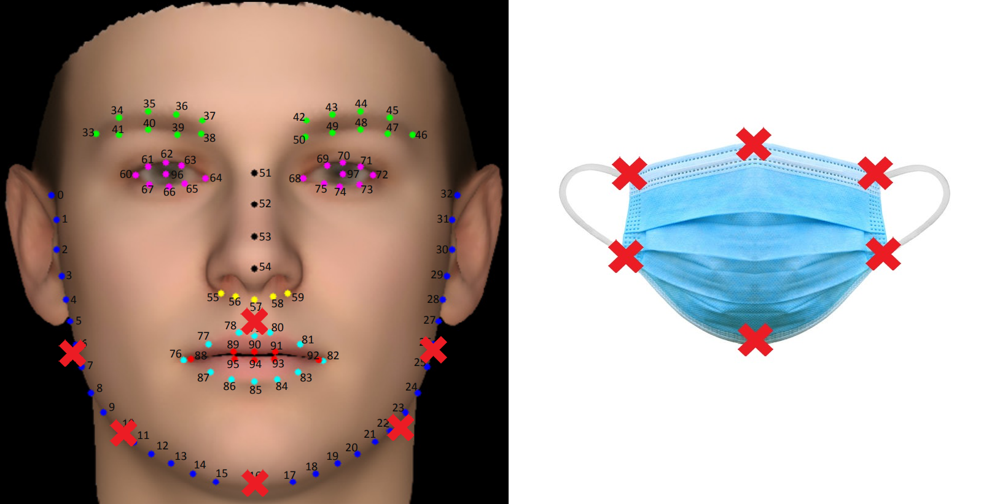
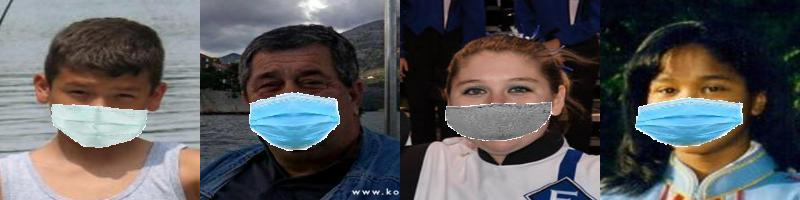
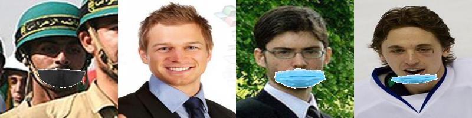
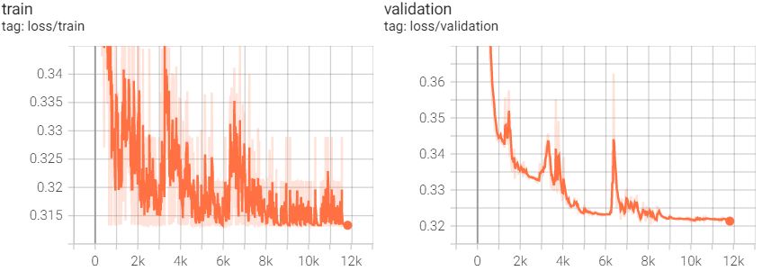
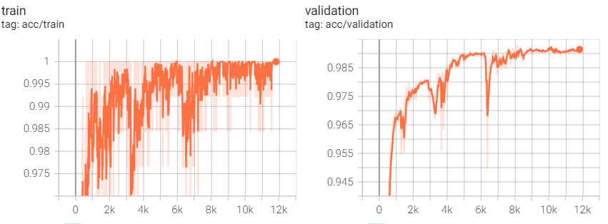
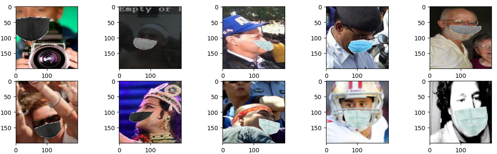
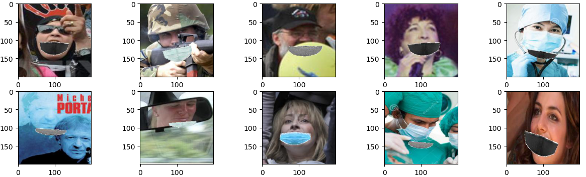

# Wearing masks correctly or not
This project contains two parts: generating masked face images, classifying whether masks are worn correctly or not.

## Generate masked face images
To train a neural network to classify masked face images, we need to generate both correctly and incorrectly masked face images. 
It's easy to generate correctly masked face images since a correct mask would cover a specific area of a face (e.g. nose and mouth).
However, there are many types of incorrect masks. 
To make it easier, this project only considers three patterns: 
1. a mask covering the mouth but not the nose
2. a mask only covering the chin
3. no mask

So there are 4 different patterns (1 correct + 3 incorrect) in total. 
Given a pattern, an intuitive way to generate it is to:
1. obtain facial landmarks
2. use landmarks and the pattern to estimate the pose of masks
3. warp a standard mask image to that pose
4. put the warped mask image on top of the face image

### Obtain facial landmarks
There are many facial landmarks datasets. 
In this project, I use [WFLW dataset](https://wywu.github.io/projects/LAB/WFLW.html) which contains 10000 faces with 98 fully manual annotated landmarks. 
Besides, we can also run facial landmark detection algorithms on unlabeled human face images.

### Estimate the pose of masks
It's easy to find standard mask images. 
Suppose there are 6 landmarks on a standard mask.
We now have a standard mask image, a face image, 6 mask landmarks, many facial landmarks and one pattern.
The problem is how to put the mask on the face according to the pattern.

Given a pattern, we can assign each mask landmark to one facial landmark.
Then we compute an affine transformation taking 6 mask landmarks and 6 facial landmarks as inputs.
Then we warp the mask image using this transformation. 
Finally, we put the warped mask image on top of the face image.

example correspondence (pattern_1):

example correspondence (pattern_2):

correctly masked face image examples:

incorrectly masked face image examples:

## Train a neural network to classify masked face images
### Data Preprocessing
There are about 10000 images in total. 
We split them to one training set, one validation set and one testing set in the ratio of 3:1:1.
We resize all images to a fixed size (224x224) and normalize them. 
We also randomly flip training images as an augmentation method.
### Model
We use [ShuffleNet V2 (x0.5)](https://arxiv.org/pdf/1807.11164.pdf) as the backbone to extract features, then use two fully-connected layers as the classifier. 
We minimize softmax cross entropy loss on the training set.
### Training
We use Adam optimizer with a learning rate of 4e-5 and weight_decay of 1e-4, use [CosineAnnealingWarmRestarts](https://arxiv.org/pdf/1608.03983.pdf) scheduler with T_0=7, T_multi=2.
We set batch_size to 128 and train the network for 200 epochs. 
### Results and analysis
During training, the highest accuracy on the validation set is 99.31%.

loss curve during training:

accuracy curve during training:

The accuracy on the test set is 98.75%.
This is a binary classification problem. 
In reality, we want to detect people who wear masks incorrectly.
So we treat incorrectly masked face images as positives, correctly masked face images as negatives.

confusion matrix:

| TP | FP | = | 2094 | 29   |
|----|----|---|------|------|
| FN | TN | = | 24   | 2089 |

FP examples:

FN examples:

As we can see, there are many FP cases that more than one face appear in one image but only one person wear a mask.
In such cases, the model might have detected the nose of unmasked faces, so it concludes that the mask is worn incorrectly.

There are two kinds of FN cases. One is that people in images have already worn masks before we put masks on them. 
To solve this kind of issues, we must manually review or run some algorithms on the original images to filter out masked face images.
The other is that faces on images are occluded by other objects, like a soldier whose nose is occluded by a gun.
This is more like a semantic issue. We know that a person's nose and mouth are both covered by something, like a 
towel. It may have the same function as a mask, but should we classify the person as wearing masks correctly? 
To solve this kind of issues, we need a more rigorous definition of "wearing mask correctly".

